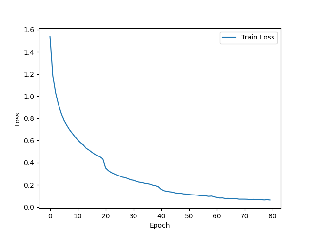
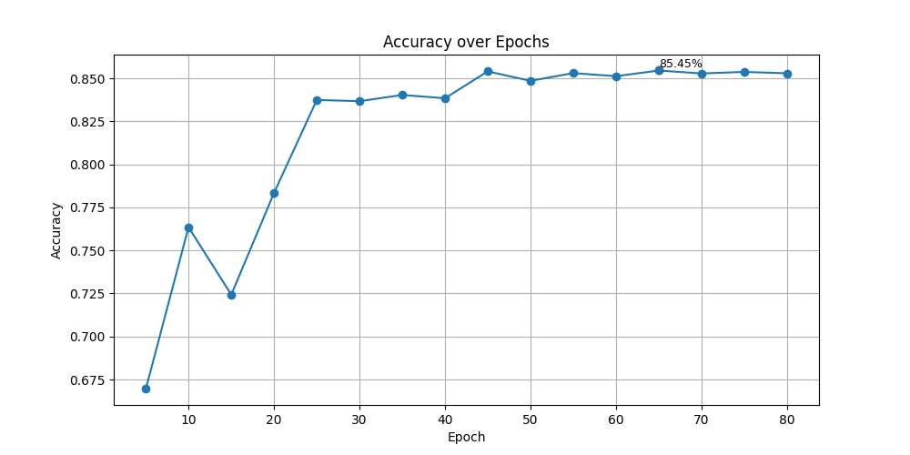
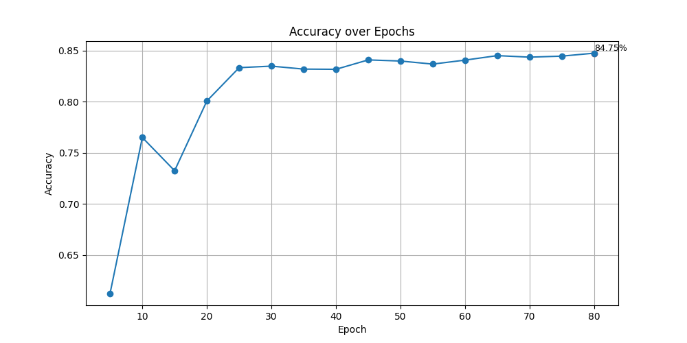

# Train ResNet on CIFAR-10 from Scratch with ColossalAI

This project selected one example from the Colossal-AI example repository, which demonstrates how to train a ResNet-18 model from scratch on the CIFAR10 dataset, and replicated this experiment in my own environment. According to the Colossal-AI documentation, the Gemini plugin and the Hybrid Parallel plugin are respectively suitable for models with more than 10 billion and 60 billion parameters. Therefore, in this test, we chose plugins more suitable for ResNet-18, the Torch DDP plugin suitable for models with less than 2 billion parameters and the Low Level Zero plugin suitable for models with less than 10 billion parameters for testing.

## Links

Colossal-AI ResNet-18 example: https://github.com/hpcaitech/ColossalAI/tree/main/examples/images/resnet

## Model and Dataset 

The model employed in this project is ResNet-18, a convolutional neural network with 18 layers, well-regarded for its efficiency and performance in image classification tasks. The dataset used is CIFAR10, which consists of 60,000 32x32 color images in 10 different classes, serving as a standard benchmark for machine learning models.

## How to Run

Training and evaluation arguments settings are consistent with those in the ColossalAI examples, with the distinction that the plugin only accepts `torch_ddp` and `low_level_zero`. Use `train_resnet.py` to train the model and `eval_all.py` to evaluate. For more details and the running logs, please refer to the content in `run.ipynb` and `eval_all.ipynb`.

#### Install Requirements

```bash
pip install -r requirements.txt
```

Use the command `colossalai check -i` to inspect the current environment.

#### Train

Initially, I ran the code with the following `colossalai` command to train, but an error occurred.

```bash
colossalai run --nproc_per_node 1 train.py -c ./ckpt-fp32
```

```
/bin/bash: line 0: export: `=/usr/bin/supervisord': not a valid identifier Error: failed to run torchrun --nproc_per_node=1 --nnodes=1 --node_rank=0 --master_addr=127.0.0.1 --master_port=29500 train.py -c ./ckpt-fp32 on 127.0.0.1, is localhost: True, exception: Encountered a bad command exit code!
...
```

This example was run on a paid platform, and the issue may have been caused by extra spaces appearing in some files after export. I found the same issue on [ColossalAI's GitHub](https://github.com/hpcaitech/ColossalAI/issues/3638) and received the following solution: replace `colossalai` with `torchrun`. Due to resource limitations, training will be conducted using only one GPU. The `--nproc_per_node` parameter can be adjusted based on conditions.

```bash
# train with torch DDP with fp32
torchrun --nproc_per_node 1 train_resnet.py -c ./ckpt-torch_ddp32

# train with low level zero
torchrun --nproc_per_node 1 train_resnet.py -c ./ckpt_resnet-low_level_zero -p low_level_zero
```

#### Eval

Use the following code to evaluate the saved models.

```bash
# evaluate fp32 training
python eval_all.py -c ./ckpt-torch_ddp32

# evaluate low level zero training
python eval_all.py -c ./ckpt_resnet-low_level_zero
```

## Experiment Results

#### Train Loss VS Epoch 

**torch_ddp_fp32** 



**low_level_zero**


#### Evaluate Result

**torch_ddp_fp32** 



Best accuracy：85.45%

**low_level_zero**



Best accuracy：84.75%

#### **Example Accuracy Performance from ColossalAI**

| Model     | Single-GPU Baseline FP32 | Booster DDP with FP32 | Booster DDP with FP16 | Booster Low Level Zero | Booster Gemini |
| --------- | ------------------------ | --------------------- | --------------------- | ---------------------- | -------------- |
| ResNet-18 | 85.85%                   | 84.91%                | 85.46%                | 84.50%                 | 84.60%         |

#### **Our Result**

| Model     | Booster DDP with FP32 | Booster Low Level Zero |
| --------- | --------------------- | ---------------------- |
| ResNet-18 | 85.45%                | 84.75%                 |

#### Analysis

The results show that the accuracy of the model trained in this experiment surpasses the expected accuracy performance provided by the ColossalAI example. Moreover, the accuracy achieved with the `torch_ddp_fp32` plugin is superior to that with `low_level_zero`. Not only does the former reach its best accuracy in fewer epochs, but it also takes less time per epoch to train, specifically between 26 to 29 seconds, compared to the latter's 41 to 46 seconds. According to the [ColossalAI document](https://colossalai.org/docs/basics/booster_plugins/), Low Level Zero-1 is considered a better alternative to Torch DDP, offering higher memory efficiency and faster speeds, and it can be easily applied in mixed parallelism settings. However, its performance in this experiment was inferior to that of Torch DDP. This suggests that each plugin may have its own advantages under different conditions, indicating the importance of making an informed choice regarding the plugin used when working with ColossalAI.
